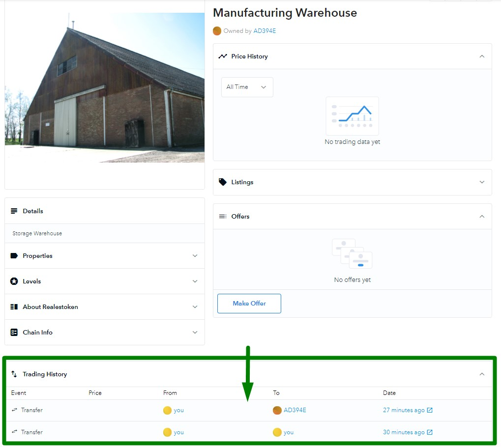

# Udacity Blockchain Capstone

The capstone is build upon the knowledge gained in the Udacity Blockchain Nanodegree course in order to build a decentralized housing product.

# Used Libraries

* Node.js: Framework used to easily build the Dapp.
* Solidity: Programming language used to programm ethereum contracts.
* Truffle: A suite used to compile, deploy and test ethereum contracts.
* Truffle HDwallet Provider: A wallet provider used to, in our case, connect to infura network.
* Web3.js: A collection of libraries used to interact with ethereum nodes.
* Zokrates: A toolbox for zkSNARKs on Ethereum.

# Program version numbers used to build and run the project

* Node.js v6.14.4
* Solidity v0.5.0
* Truffle v5.1.27
* truffle-hdwallet-provider v1.2.0

# Testing the project

Follow these steps to run the tests:
1. Navigate to tests folder: `cd eth-contracts` 
2. Run all the test files: `truffle test`
    - To run just one test file: `truffle test test/TestERC721Mintable.js`

# Deployed contract address

The contracts have been deployed at theese addesses

* Migrations: [Transaction](https://rinkeby.etherscan.io/tx/0x6b75e026e2065a1ff465f21f4ba2556d5e0427e912350d331ada8bbc91f895c8) and [Address](https://rinkeby.etherscan.io/address/0x3Cff2331E8B4a31387b0df02710D5eF9CD811630)

* SolnSquareVerifier: [Transaction](https://rinkeby.etherscan.io/tx/0x9a177dbf63eb91751fa125f03318213179ab76cef44e12b6c5cec09fd04c3f6c) and [Adress](https://rinkeby.etherscan.io/address/0x17256037237E4649B7F4A94C0f822CB34eC4d1D3)

## OpenSea Assets
Minted assests can be found in OpenSea website.
https://testnets.opensea.io/assets/realestoken

The transactions made by each one can be consulted clicking on them:


## My Ether Wallet
Contracts can be interacted with different public resources such as [myetherwallet.com](https://www.myetherwallet.com/). To do so, the contract ABI is needed along with the deployed contract address.

## SolnSquareVerifier ABI
```
[    
    {
    "anonymous": false,
    "inputs": [
        {
        "indexed": false,
        "internalType": "uint256",
        "name": "index",
        "type": "uint256"
        },
        {
        "indexed": false,
        "internalType": "address",
        "name": "sender",
        "type": "address"
        }
    ],
    "name": "Added",
    "type": "event"
    },
    {
    "anonymous": false,
    "inputs": [
        {
        "indexed": true,
        "internalType": "address",
        "name": "owner",
        "type": "address"
        },
        {
        "indexed": true,
        "internalType": "address",
        "name": "approved",
        "type": "address"
        },
        {
        "indexed": true,
        "internalType": "uint256",
        "name": "tokenId",
        "type": "uint256"
        }
    ],
    "name": "Approval",
    "type": "event"
    },
    {
    "anonymous": false,
    "inputs": [
        {
        "indexed": true,
        "internalType": "address",
        "name": "owner",
        "type": "address"
        },
        {
        "indexed": true,
        "internalType": "address",
        "name": "operator",
        "type": "address"
        },
        {
        "indexed": false,
        "internalType": "bool",
        "name": "approved",
        "type": "bool"
        }
    ],
    "name": "ApprovalForAll",
    "type": "event"
    },
    {
    "anonymous": false,
    "inputs": [
        {
        "indexed": false,
        "internalType": "address",
        "name": "owner",
        "type": "address"
        }
    ],
    "name": "NewOwner",
    "type": "event"
    },
    {
    "anonymous": false,
    "inputs": [
        {
        "indexed": false,
        "internalType": "address",
        "name": "trigger",
        "type": "address"
        }
    ],
    "name": "Paused",
    "type": "event"
    },
    {
    "anonymous": false,
    "inputs": [
        {
        "indexed": true,
        "internalType": "address",
        "name": "from",
        "type": "address"
        },
        {
        "indexed": true,
        "internalType": "address",
        "name": "to",
        "type": "address"
        },
        {
        "indexed": true,
        "internalType": "uint256",
        "name": "tokenId",
        "type": "uint256"
        }
    ],
    "name": "Transfer",
    "type": "event"
    },
    {
    "anonymous": false,
    "inputs": [
        {
        "indexed": false,
        "internalType": "address",
        "name": "trigger",
        "type": "address"
        }
    ],
    "name": "Unpaused",
    "type": "event"
    },
    {
    "constant": false,
    "inputs": [
        {
        "internalType": "bytes32",
        "name": "_myid",
        "type": "bytes32"
        },
        {
        "internalType": "string",
        "name": "_result",
        "type": "string"
        }
    ],
    "name": "__callback",
    "outputs": [],
    "payable": false,
    "stateMutability": "nonpayable",
    "type": "function"
    },
    {
    "constant": false,
    "inputs": [
        {
        "internalType": "bytes32",
        "name": "_myid",
        "type": "bytes32"
        },
        {
        "internalType": "string",
        "name": "_result",
        "type": "string"
        },
        {
        "internalType": "bytes",
        "name": "_proof",
        "type": "bytes"
        }
    ],
    "name": "__callback",
    "outputs": [],
    "payable": false,
    "stateMutability": "nonpayable",
    "type": "function"
    },
    {
    "constant": false,
    "inputs": [
        {
        "internalType": "address",
        "name": "to",
        "type": "address"
        },
        {
        "internalType": "uint256",
        "name": "tokenId",
        "type": "uint256"
        }
    ],
    "name": "approve",
    "outputs": [],
    "payable": false,
    "stateMutability": "nonpayable",
    "type": "function"
    },
    {
    "constant": true,
    "inputs": [
        {
        "internalType": "address",
        "name": "owner",
        "type": "address"
        }
    ],
    "name": "balanceOf",
    "outputs": [
        {
        "internalType": "uint256",
        "name": "",
        "type": "uint256"
        }
    ],
    "payable": false,
    "stateMutability": "view",
    "type": "function"
    },
    {
    "constant": true,
    "inputs": [
        {
        "internalType": "uint256",
        "name": "tokenId",
        "type": "uint256"
        }
    ],
    "name": "getApproved",
    "outputs": [
        {
        "internalType": "address",
        "name": "",
        "type": "address"
        }
    ],
    "payable": false,
    "stateMutability": "view",
    "type": "function"
    },
    {
    "constant": true,
    "inputs": [],
    "name": "getBaseTokenURI",
    "outputs": [
        {
        "internalType": "string",
        "name": "",
        "type": "string"
        }
    ],
    "payable": false,
    "stateMutability": "view",
    "type": "function"
    },
    {
    "constant": true,
    "inputs": [],
    "name": "getOwner",
    "outputs": [
        {
        "internalType": "address",
        "name": "",
        "type": "address"
        }
    ],
    "payable": false,
    "stateMutability": "view",
    "type": "function"
    },
    {
    "constant": true,
    "inputs": [
        {
        "internalType": "address",
        "name": "owner",
        "type": "address"
        },
        {
        "internalType": "address",
        "name": "operator",
        "type": "address"
        }
    ],
    "name": "isApprovedForAll",
    "outputs": [
        {
        "internalType": "bool",
        "name": "",
        "type": "bool"
        }
    ],
    "payable": false,
    "stateMutability": "view",
    "type": "function"
    },
    {
    "constant": true,
    "inputs": [],
    "name": "isPaused",
    "outputs": [
        {
        "internalType": "bool",
        "name": "",
        "type": "bool"
        }
    ],
    "payable": false,
    "stateMutability": "view",
    "type": "function"
    },
    {
    "constant": false,
    "inputs": [
        {
        "internalType": "address",
        "name": "to",
        "type": "address"
        },
        {
        "internalType": "uint256",
        "name": "tokenId",
        "type": "uint256"
        }
    ],
    "name": "mint",
    "outputs": [
        {
        "internalType": "bool",
        "name": "",
        "type": "bool"
        }
    ],
    "payable": false,
    "stateMutability": "nonpayable",
    "type": "function"
    },
    {
    "constant": true,
    "inputs": [],
    "name": "name",
    "outputs": [
        {
        "internalType": "string",
        "name": "",
        "type": "string"
        }
    ],
    "payable": false,
    "stateMutability": "view",
    "type": "function"
    },
    {
    "constant": true,
    "inputs": [
        {
        "internalType": "uint256",
        "name": "tokenId",
        "type": "uint256"
        }
    ],
    "name": "ownerOf",
    "outputs": [
        {
        "internalType": "address",
        "name": "",
        "type": "address"
        }
    ],
    "payable": false,
    "stateMutability": "view",
    "type": "function"
    },
    {
    "constant": false,
    "inputs": [
        {
        "internalType": "address",
        "name": "from",
        "type": "address"
        },
        {
        "internalType": "address",
        "name": "to",
        "type": "address"
        },
        {
        "internalType": "uint256",
        "name": "tokenId",
        "type": "uint256"
        }
    ],
    "name": "safeTransferFrom",
    "outputs": [],
    "payable": false,
    "stateMutability": "nonpayable",
    "type": "function"
    },
    {
    "constant": false,
    "inputs": [
        {
        "internalType": "address",
        "name": "from",
        "type": "address"
        },
        {
        "internalType": "address",
        "name": "to",
        "type": "address"
        },
        {
        "internalType": "uint256",
        "name": "tokenId",
        "type": "uint256"
        },
        {
        "internalType": "bytes",
        "name": "_data",
        "type": "bytes"
        }
    ],
    "name": "safeTransferFrom",
    "outputs": [],
    "payable": false,
    "stateMutability": "nonpayable",
    "type": "function"
    },
    {
    "constant": false,
    "inputs": [
        {
        "internalType": "address",
        "name": "to",
        "type": "address"
        },
        {
        "internalType": "bool",
        "name": "approved",
        "type": "bool"
        }
    ],
    "name": "setApprovalForAll",
    "outputs": [],
    "payable": false,
    "stateMutability": "nonpayable",
    "type": "function"
    },
    {
    "constant": false,
    "inputs": [
        {
        "internalType": "bool",
        "name": "paused",
        "type": "bool"
        }
    ],
    "name": "setPaused",
    "outputs": [],
    "payable": false,
    "stateMutability": "nonpayable",
    "type": "function"
    },
    {
    "constant": true,
    "inputs": [
        {
        "internalType": "uint256",
        "name": "",
        "type": "uint256"
        }
    ],
    "name": "solutions",
    "outputs": [
        {
        "internalType": "uint256",
        "name": "index",
        "type": "uint256"
        },
        {
        "internalType": "address",
        "name": "sender",
        "type": "address"
        }
    ],
    "payable": false,
    "stateMutability": "view",
    "type": "function"
    },
    {
    "constant": true,
    "inputs": [
        {
        "internalType": "bytes32",
        "name": "",
        "type": "bytes32"
        }
    ],
    "name": "submitted",
    "outputs": [
        {
        "internalType": "uint256",
        "name": "index",
        "type": "uint256"
        },
        {
        "internalType": "address",
        "name": "sender",
        "type": "address"
        }
    ],
    "payable": false,
    "stateMutability": "view",
    "type": "function"
    },
    {
    "constant": true,
    "inputs": [
        {
        "internalType": "bytes4",
        "name": "interfaceId",
        "type": "bytes4"
        }
    ],
    "name": "supportsInterface",
    "outputs": [
        {
        "internalType": "bool",
        "name": "",
        "type": "bool"
        }
    ],
    "payable": false,
    "stateMutability": "view",
    "type": "function"
    },
    {
    "constant": true,
    "inputs": [],
    "name": "symbol",
    "outputs": [
        {
        "internalType": "string",
        "name": "",
        "type": "string"
        }
    ],
    "payable": false,
    "stateMutability": "view",
    "type": "function"
    },
    {
    "constant": true,
    "inputs": [
        {
        "internalType": "uint256",
        "name": "index",
        "type": "uint256"
        }
    ],
    "name": "tokenByIndex",
    "outputs": [
        {
        "internalType": "uint256",
        "name": "",
        "type": "uint256"
        }
    ],
    "payable": false,
    "stateMutability": "view",
    "type": "function"
    },
    {
    "constant": true,
    "inputs": [
        {
        "internalType": "address",
        "name": "owner",
        "type": "address"
        },
        {
        "internalType": "uint256",
        "name": "index",
        "type": "uint256"
        }
    ],
    "name": "tokenOfOwnerByIndex",
    "outputs": [
        {
        "internalType": "uint256",
        "name": "",
        "type": "uint256"
        }
    ],
    "payable": false,
    "stateMutability": "view",
    "type": "function"
    },
    {
    "constant": true,
    "inputs": [
        {
        "internalType": "uint256",
        "name": "tokenId",
        "type": "uint256"
        }
    ],
    "name": "tokenURI",
    "outputs": [
        {
        "internalType": "string",
        "name": "",
        "type": "string"
        }
    ],
    "payable": false,
    "stateMutability": "view",
    "type": "function"
    },
    {
    "constant": true,
    "inputs": [],
    "name": "totalSupply",
    "outputs": [
        {
        "internalType": "uint256",
        "name": "",
        "type": "uint256"
        }
    ],
    "payable": false,
    "stateMutability": "view",
    "type": "function"
    },
    {
    "constant": false,
    "inputs": [
        {
        "internalType": "address",
        "name": "from",
        "type": "address"
        },
        {
        "internalType": "address",
        "name": "to",
        "type": "address"
        },
        {
        "internalType": "uint256",
        "name": "tokenId",
        "type": "uint256"
        }
    ],
    "name": "transferFrom",
    "outputs": [],
    "payable": false,
    "stateMutability": "nonpayable",
    "type": "function"
    },
    {
    "constant": false,
    "inputs": [
        {
        "internalType": "address",
        "name": "newOwner",
        "type": "address"
        }
    ],
    "name": "transferOwnership",
    "outputs": [],
    "payable": false,
    "stateMutability": "nonpayable",
    "type": "function"
    },
    {
    "constant": true,
    "inputs": [
        {
        "internalType": "uint256[2]",
        "name": "a",
        "type": "uint256[2]"
        },
        {
        "internalType": "uint256[2][2]",
        "name": "b",
        "type": "uint256[2][2]"
        },
        {
        "internalType": "uint256[2]",
        "name": "c",
        "type": "uint256[2]"
        },
        {
        "internalType": "uint256[2]",
        "name": "input",
        "type": "uint256[2]"
        }
    ],
    "name": "verifyTx",
    "outputs": [
        {
        "internalType": "bool",
        "name": "r",
        "type": "bool"
        }
    ],
    "payable": false,
    "stateMutability": "view",
    "type": "function"
    },
    {
    "constant": false,
    "inputs": [
        {
        "internalType": "uint256[2]",
        "name": "a",
        "type": "uint256[2]"
        },
        {
        "internalType": "uint256[2][2]",
        "name": "b",
        "type": "uint256[2][2]"
        },
        {
        "internalType": "uint256[2]",
        "name": "c",
        "type": "uint256[2]"
        },
        {
        "internalType": "uint256[2]",
        "name": "input",
        "type": "uint256[2]"
        }
    ],
    "name": "add",
    "outputs": [],
    "payable": false,
    "stateMutability": "nonpayable",
    "type": "function"
    },
    {
    "constant": false,
    "inputs": [
        {
        "internalType": "uint256[2]",
        "name": "a",
        "type": "uint256[2]"
        },
        {
        "internalType": "uint256[2][2]",
        "name": "b",
        "type": "uint256[2][2]"
        },
        {
        "internalType": "uint256[2]",
        "name": "c",
        "type": "uint256[2]"
        },
        {
        "internalType": "uint256[2]",
        "name": "input",
        "type": "uint256[2]"
        },
        {
        "internalType": "uint256",
        "name": "tokenId",
        "type": "uint256"
        }
    ],
    "name": "verifyAndMint",
    "outputs": [],
    "payable": false,
    "stateMutability": "nonpayable",
    "type": "function"
    }
]
```

# Project Resources

* [Remix - Solidity IDE](https://remix.ethereum.org/)
* [Visual Studio Code](https://code.visualstudio.com/)
* [Truffle Framework](https://truffleframework.com/)
* [Ganache - One Click Blockchain](https://truffleframework.com/ganache)
* [Open Zeppelin ](https://openzeppelin.org/)
* [Interactive zero knowledge 3-colorability demonstration](http://web.mit.edu/~ezyang/Public/graph/svg.html)
* [Docker](https://docs.docker.com/install/)
* [ZoKrates](https://github.com/Zokrates/ZoKrates)